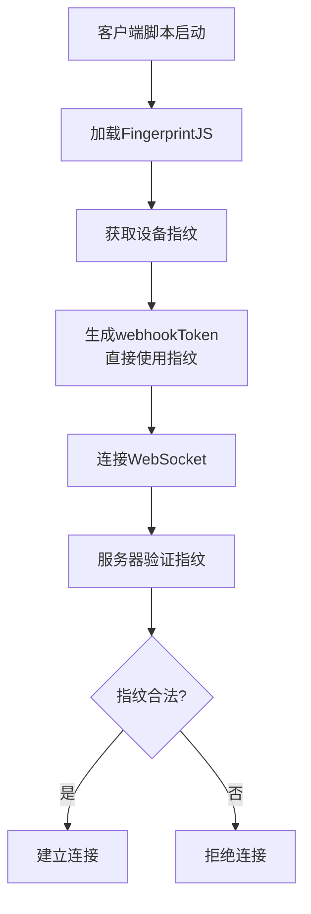

# FingerprintJS指纹识别集成实施计划

## 概述

本计划将使用 FingerprintJS 开源版（v5）实现设备指纹识别，直接使用指纹作为 `webhookToken`，并将其作为长期设备标识进行服务器端验证。

## 系统架构



## 详细实施步骤

### 1. 客户端修改 (znhd.user.js)

#### 1.1 添加 FingerprintJS 依赖

在脚本头部 `@require` 部分添加：

```javascript
// @require     https://cdn.jsdelivr.net/npm/@fingerprintjs/fingerprintjs@5/dist/fp.min.js
```

#### 1.2 新增指纹管理模块

```javascript
// ========== 指纹管理 ==========
const FINGERPRINT_KEY = 'scriptCat_Fingerprint';

// 初始化 FingerprintJS
async function initFingerprint() {
    const fp = await FingerprintJS.load();
    const result = await fp.get();
    return result.visitorId;
}

// 获取或生成设备指纹
async function getOrCreateFingerprint() {
    // 尝试从存储获取
    const saved = localStorage.getItem(FINGERPRINT_KEY);
    if (saved) return saved;
    
    // 获取新指纹
    const fingerprint = await initFingerprint();
    localStorage.setItem(FINGERPRINT_KEY, fingerprint);
    return fingerprint;
}
```

#### 1.3 修改配置生成逻辑

```javascript
// 修改 generateNewWebhookConfig 函数
async function generateNewWebhookConfig() {
    const fingerprint = await getOrCreateFingerprint();
    // 直接使用指纹作为webhookToken
    const newWebhookToken = fingerprint;
    const newPostToken = btoa(newWebhookToken);
    
    patchAllvalue({
        webhookUrl: "https://znhd-service.zeabur.app",
        webhookToken: newWebhookToken,
        postToken: newPostToken
    });
    addLog('webhook配置已基于设备指纹生成', 'info');
}
```

### 2. 服务器端修改 (main.py)

#### 2.1 新增 Redis 数据结构

```
# 指纹存储结构
key: fingerprint:{fingerprint}
value: JSON {
    "fingerprint": "xxx",
    "created_at": "ISO时间",
    "last_seen": "ISO时间",
    "ip": "xxx",
    "location": "xxx"
}

# 设备黑名单
key: fingerprint:blocked:{fingerprint}
value: "blocked_reason"
```

#### 2.2 新增指纹注册API

在 WebSocket 连接时自动注册指纹：

```python
@app.websocket("/stream")
async def websocket_endpoint(websocket: WebSocket, token: str = Query(...)):
    """WebSocket 连接端点 - 指纹验证"""
    fingerprint = token  # webhookToken直接作为指纹
    
    # 检查是否在黑名单中
    blocked = await redis_client.get(f"fingerprint:blocked:{fingerprint}")
    if blocked:
        logger.warning(f"拒绝封禁设备的连接: {fingerprint}")
        await websocket.close(code=4000, reason="设备已被封禁")
        return
    
    # 检查指纹是否存在，不存在则自动注册
    fp_data = await redis_client.get(f"fingerprint:{fingerprint}")
    if not fp_data:
        geo_info = await get_geo_info(request)
        fp_data_new = {
            "fingerprint": fingerprint,
            "created_at": datetime.now().isoformat(),
            "last_seen": datetime.now().isoformat(),
            "ip": geo_info.get("ip", ""),
            "location": f"{geo_info.get('country', '')} {geo_info.get('region', '')} {geo_info.get('city', '')}"
        }
        await redis_client.set(
            f"fingerprint:{fingerprint}",
            json.dumps(fp_data_new, ensure_ascii=False),
            ex=30*24*60*60  # 30天过期
        )
        logger.info(f"新设备指纹已注册: {fingerprint}")
    
    # 继续原有连接逻辑...
```

#### 2.3 新增指纹查询API（管理用）

```python
@app.get("/api/fingerprint/list")
async def list_fingerprints(session_token: Optional[str] = Cookie(None)):
    """获取所有已注册的设备指纹"""
    if not verify_session(session_token):
        raise HTTPException(status_code=401, detail="未授权")
    
    if not redis_client:
        return {"error": "Redis未连接", "data": []}
    
    try:
        # 获取所有 fingerprint:* 键
        keys = await redis_client.keys("fingerprint:*")
        fingerprints = []
        
        for key in keys:
            # 跳过黑名单键
            if ":blocked:" in key:
                continue
            
            value = await redis_client.get(key)
            data = json.loads(value)
            fingerprints.append({
                "fingerprint": data.get("fingerprint", ""),
                "created_at": data.get("created_at", ""),
                "last_seen": data.get("last_seen", ""),
                "ip": data.get("ip", ""),
                "location": data.get("location", "")
            })
        
        return {"data": fingerprints, "total": len(fingerprints)}
    except Exception as e:
        logger.error(f"获取指纹列表失败: {e}")
        return {"error": str(e), "data": []}

@app.post("/api/fingerprint/block")
async def block_fingerprint(
    fingerprint: str,
    reason: str = "管理员封禁",
    session_token: Optional[str] = Cookie(None)
):
    """封禁设备指纹"""
    if not verify_session(session_token):
        raise HTTPException(status_code=401, detail="未授权")
    
    await redis_client.set(
        f"fingerprint:blocked:{fingerprint}",
        reason,
        ex=365*24*60*60  # 1年过期
    )
    
    # 关闭该设备的现有连接
    if fingerprint in manager.active_connections:
        for conn in manager.active_connections[fingerprint]:
            await conn.close(code=4001, reason="设备已被封禁")
        del manager.active_connections[fingerprint]
    
    return {"success": True, "message": "设备已封禁"}

@app.post("/api/fingerprint/unblock")
async def unblock_fingerprint(
    fingerprint: str,
    session_token: Optional[str] = Cookie(None)
):
    """解除设备指纹封禁"""
    if not verify_session(session_token):
        raise HTTPException(status_code=401, detail="未授权")
    
    await redis_client.delete(f"fingerprint:blocked:{fingerprint}")
    return {"success": True, "message": "设备已解封"}
```

### 3. 管理后台增强 (admin.html)

在 `admin.html` 中添加设备指纹管理功能：

- 查看所有注册的设备指纹列表
- 封禁/解封设备
- 查看设备详细信息（IP、位置、创建时间、最后活跃时间）

## 安全考虑

1. **指纹有效期**：30天无活动后自动过期
2. **黑名单机制**：支持封禁恶意设备
3. **会话验证**：管理API需要管理员登录

## 测试计划

1. 指纹生成和验证逻辑测试
2. 完整的连接和验证流程测试
3. 黑名单功能测试

## 文件修改清单

| 文件           | 修改内容                                     |
|----------------|----------------------------------------------|
| `znhd.user.js` | 添加FingerprintJS依赖、指纹管理模块          |
| `main.py`      | 新增指纹注册逻辑、管理API、修改WebSocket逻辑 |
| `admin.html`   | 新增指纹管理界面                             |
| `README.md`    | 更新文档说明指纹集成功能                     |
