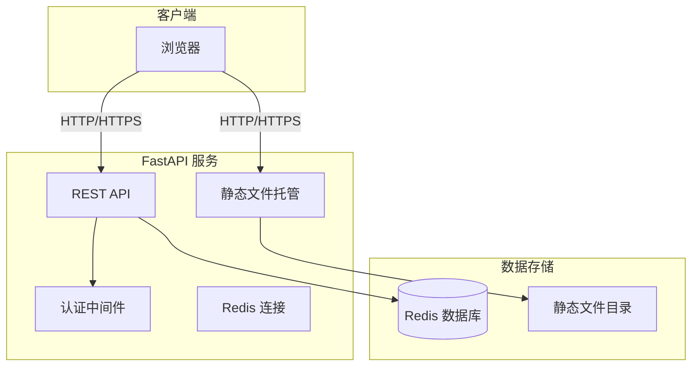

# Webhook 服务前后端合并实施方案

## 1. 项目概述

本项目旨在将 `gotify-post`（前端静态页面）和 `webhook-service`（FastAPI 后端服务）合并为一个统一的 Web 应用，提供以下功能：

1. **主页面**：集成 gotify-post 的 POST 请求发送工具界面
2. **登录功能**：简单的固定密码认证机制
3. **管理后台**：登录后可查询 Redis 数据库中的数据

---

## 2. 技术架构



---

## 3. 目录结构

```
webhook-service/
├── main.py                 # FastAPI 主应用
├── requirements.txt        # Python 依赖
├── Dockerfile             # Docker 构建配置
├── README.md              # 项目说明
├── static/                # 静态文件目录
│   └── index.html         # 主页面（POST请求工具）
├── templates/             # HTML 模板目录
│   ├── login.html         # 登录页面
│   └── admin.html         # 管理后台页面
└── other/                 # 其他文件（保留）
```

---

## 4. 详细实施步骤

### 步骤 1：创建项目目录结构

在 `webhook-service/` 目录下创建：
- `static/` - 用于存放主页面 `index.html`
- `templates/` - 用于存放登录和管理后台页面

### 步骤 2：集成前端页面

**操作内容**：
1. 将 `gotify-post/index.html` 移动到 `webhook-service/static/index.html`
2. 在页面右上角添加登录按钮
3. 登录按钮点击后跳转到登录页面或弹出登录模态框

**新增登录按钮位置**：页面右上角（可与页面标题在同一行）

### 步骤 3：创建登录页面

**文件**：`webhook-service/templates/login.html`

**功能需求**：
- 固定密码验证（从环境变量读取，如 `ADMIN_PASSWORD`）
- 登录成功后设置 Session/Cookie
- 登录失败显示错误提示

**UI 设计**：
- 简洁的登录表单
- 密码输入框
- 登录按钮
- 错误信息提示区域

### 步骤 4：创建管理后台页面

**文件**：`webhook-service/templates/admin.html`

**功能需求**：
- 查询 Redis 数据库按钮
- 显示 Redis 数据结果
- 支持多种查询方式（如按前缀查询、获取所有 key 等）
- 数据显示格式：JSON 格式化展示

**UI 设计**：
- 页面标题
- 查询操作区域
- 结果展示区域（可滚动的 JSON 查看器）

### 步骤 5：实现静态文件托管

**修改文件**：`webhook-service/main.py`

**新增代码**：
```python
from fastapi.staticfiles import StaticFiles
from fastapi.templating import Jinja2Templates

# 挂载静态文件
app.mount("/static", StaticFiles(directory="static"), name="static")

# 模板渲染
templates = Jinja2Templates(directory="templates")
```

### 步骤 6：实现登录认证 API

**新增 API 端点**：

1. **登录接口**：`POST /api/login`
   - 请求体：`{ "password": "your_password" }`
   - 验证密码是否匹配环境变量 `ADMIN_PASSWORD`
   - 成功返回 Token/Cookie
   - 失败返回 401 错误

2. **验证接口**：`GET /api/auth/check`
   - 检查当前请求是否已认证

3. **登出接口**：`POST /api/logout`
   - 清除认证状态

**认证方式**：使用简单的 Token 或 Cookie 机制

### 步骤 7：实现 Redis 查询 API

**新增 API 端点**：

1. **获取所有数据**：`GET /api/admin/redis/all`
   - 扫描 Redis 中的所有 key
   - 返回键值对列表

2. **按模式查询**：`GET /api/admin/redis/keys?pattern=<pattern>`
   - 支持通配符查询（如 `client:*`）

3. **获取单个值**：`GET /api/admin/redis/key/{key}`
   - 根据 key 获取对应值

4. **获取统计信息**：`GET /api/admin/redis/stats`
   - 返回 Redis 数据库统计信息（如 key 数量、内存使用等）

### 步骤 8：更新依赖文件

**修改文件**：`webhook-service/requirements.txt`

**新增依赖**：
```
python-jose==3.3.0      # JWT 处理
passlib==1.7.4          # 密码加密
bcrypt==4.1.1           # bcrypt 哈希
python-multipart==0.0.6 # 文件上传支持（用于表单）
jinja2==3.1.2           # 模板引擎
```

### 步骤 9：更新 Dockerfile

**修改内容**：
```dockerfile
# 复制静态文件和模板
COPY static/ ./static/
COPY templates/ ./templates/
```

### 步骤 10：更新项目文档

**修改文件**：`webhook-service/README.md`

**新增内容**：
- 新增功能说明
- API 接口文档
- 环境变量配置说明
- 使用指南

---

## 5. 环境变量配置

| 变量名           | 必填 | 默认值                   | 说明             |
|------------------|------|--------------------------|------------------|
| `REDIS_URI`      | 否   | `redis://localhost:6379` | Redis 连接地址   |
| `ADMIN_PASSWORD` | 否   | `admin123`               | 管理后台登录密码 |
| `SESSION_SECRET` | 否   | 自动生成                 | Session 加密密钥 |

---

## 6. 安全考虑

1. **密码存储**：使用 bcrypt 对密码进行哈希处理
2. **会话管理**：使用安全的 Session Cookie（HttpOnly, Secure）
3. **输入验证**：对所有用户输入进行验证
4. **错误处理**：不暴露敏感信息在错误消息中
5. **HTTPS**：生产环境应启用 HTTPS

---

## 7. 部署说明

### 本地开发
```bash
cd webhook-service
pip install -r requirements.txt
uvicorn main:app --reload
```

### Docker 部署
```bash
cd webhook-service
docker build -t webhook-service .
docker run -p 8000:8000 -e REDIS_URI=redis://host:6379 -e ADMIN_PASSWORD=your_password webhook-service
```

### Zeabur 部署
1. 连接 Redis 服务
2. 设置环境变量：`ADMIN_PASSWORD`
3. 部署服务

---

## 8. 风险评估与应对

| 风险         | 影响 | 应对措施                      |
|--------------|------|-------------------------------|
| 静态文件访问 | 低   | 无敏感数据，仅前端页面        |
| 密码泄露     | 高   | 使用环境变量，定期更换        |
| Redis 安全   | 中   | 仅内部访问，不暴露 Redis 端口 |
| 权限控制     | 高   | 管理页面需登录才能访问        |

---

## 9. 验收标准

- [ ] 主页面能正常访问并显示 POST 请求工具
- [ ] 右上角有登录按钮
- [ ] 未登录时点击管理功能会跳转到登录页
- [ ] 登录功能正常工作（正确密码登录成功，错误密码拒绝）
- [ ] 管理后台能正确查询 Redis 数据
- [ ] Docker 构建成功且能正常运行
- [ ] 代码结构清晰，有适当注释
